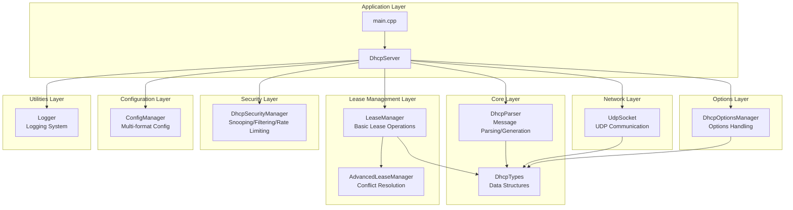
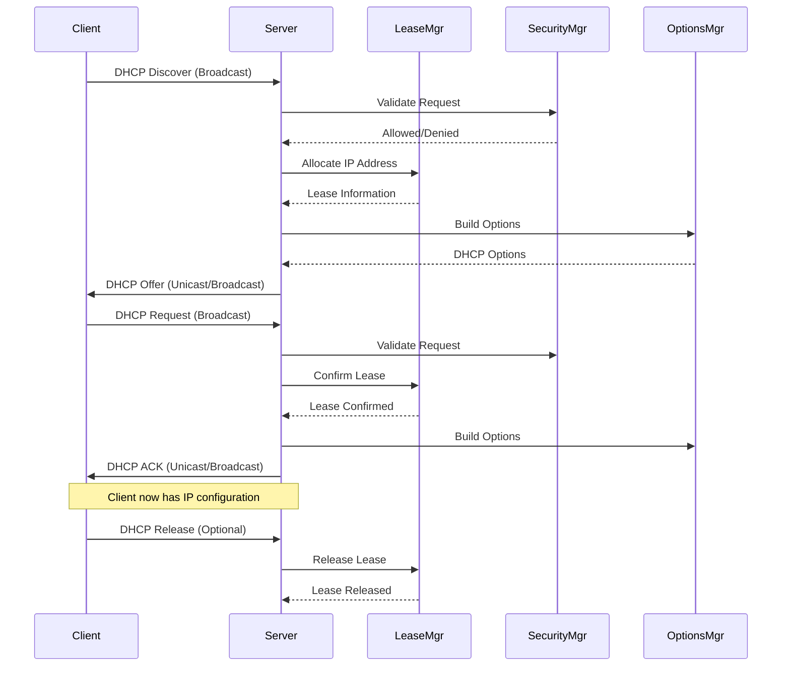
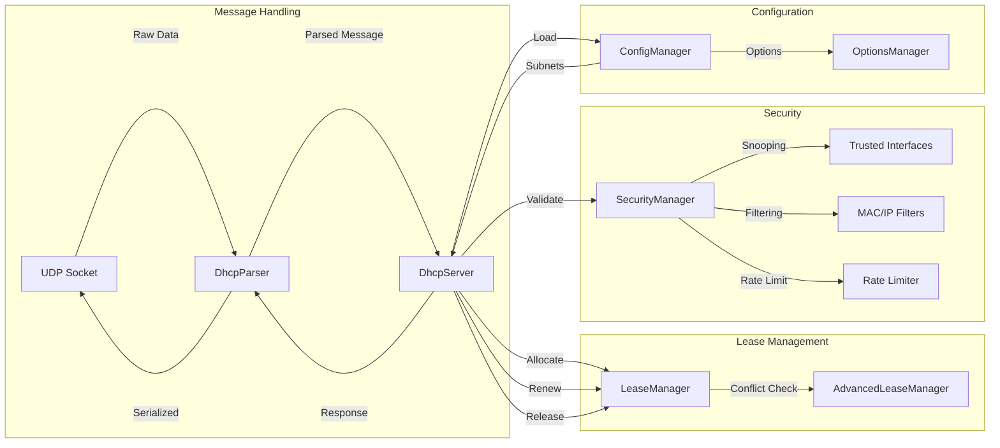
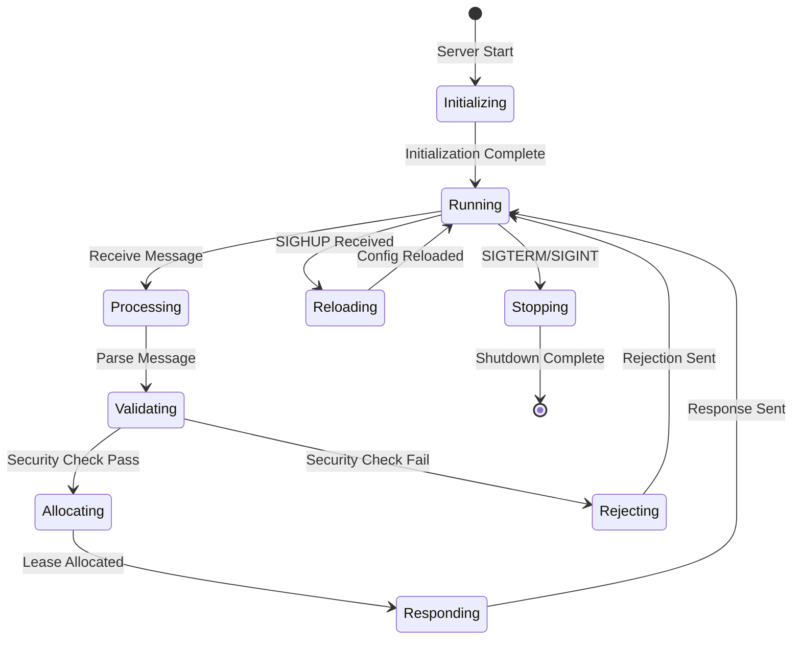

# Simple DHCP Daemon - Architecture Diagrams

## System Architecture

```mermaid
graph TB
    subgraph "Application Layer"
        Main[main.cpp]
        Server[DhcpServer]
    end
    
    subgraph "Core Layer"
        Parser[DhcpParser<br/>Message Parsing/Generation]
        Types[DhcpTypes<br/>Data Structures]
    end
    
    subgraph "Network Layer"
        Socket[UdpSocket<br/>UDP Communication]
    end
    
    subgraph "Lease Management Layer"
        LeaseMgr[LeaseManager<br/>Basic Lease Operations]
        AdvLeaseMgr[AdvancedLeaseManager<br/>Conflict Resolution]
    end
    
    subgraph "Options Layer"
        OptionsMgr[DhcpOptionsManager<br/>Options Handling]
    end
    
    subgraph "Security Layer"
        SecurityMgr[DhcpSecurityManager<br/>Snooping/Filtering/Rate Limiting]
    end
    
    subgraph "Configuration Layer"
        ConfigMgr[ConfigManager<br/>Multi-format Config]
    end
    
    subgraph "Utilities Layer"
        Logger[Logger<br/>Logging System]
    end
    
    Main --> Server
    Server --> Parser
    Server --> Socket
    Server --> LeaseMgr
    Server --> OptionsMgr
    Server --> SecurityMgr
    Server --> ConfigMgr
    Server --> Logger
    
    LeaseMgr --> AdvLeaseMgr
    Parser --> Types
    Socket --> Types
    LeaseMgr --> Types
    OptionsMgr --> Types
```

## DORA Process Flow

```mermaid
sequenceDiagram
    participant Client
    participant Server
    participant LeaseMgr
    participant SecurityMgr
    participant OptionsMgr
    
    Client->>Server: DHCP Discover (Broadcast)
    Server->>SecurityMgr: Validate Request
    SecurityMgr-->>Server: Allowed/Denied
    Server->>LeaseMgr: Allocate IP Address
    LeaseMgr-->>Server: Lease Information
    Server->>OptionsMgr: Build Options
    OptionsMgr-->>Server: DHCP Options
    Server->>Client: DHCP Offer (Unicast/Broadcast)
    
    Client->>Server: DHCP Request (Broadcast)
    Server->>SecurityMgr: Validate Request
    Server->>LeaseMgr: Confirm Lease
    LeaseMgr-->>Server: Lease Confirmed
    Server->>OptionsMgr: Build Options
    Server->>Client: DHCP ACK (Unicast/Broadcast)
    
    Note over Client,Server: Client now has IP configuration
    
    Client->>Server: DHCP Release (Optional)
    Server->>LeaseMgr: Release Lease
    LeaseMgr-->>Server: Lease Released
```

## Component Interaction

```mermaid
graph LR
    subgraph "Message Handling"
        A[UDP Socket] -->|Raw Data| B[DhcpParser]
        B -->|Parsed Message| C[DhcpServer]
        C -->|Response| B
        B -->|Serialized| A
    end
    
    subgraph "Lease Management"
        C -->|Allocate| D[LeaseManager]
        C -->|Renew| D
        C -->|Release| D
        D -->|Conflict Check| E[AdvancedLeaseManager]
    end
    
    subgraph "Security"
        C -->|Validate| F[SecurityManager]
        F -->|Snooping| G[Trusted Interfaces]
        F -->|Filtering| H[MAC/IP Filters]
        F -->|Rate Limit| I[Rate Limiter]
    end
    
    subgraph "Configuration"
        C -->|Load| J[ConfigManager]
        J -->|Subnets| C
        J -->|Options| K[OptionsManager]
    end
```

## State Machine

```mermaid
stateDiagram-v2
    [*] --> Initializing: Server Start
    Initializing --> Running: Initialization Complete
    Running --> Processing: Receive Message
    Processing --> Validating: Parse Message
    Validating --> Allocating: Security Check Pass
    Validating --> Rejecting: Security Check Fail
    Allocating --> Responding: Lease Allocated
    Responding --> Running: Response Sent
    Rejecting --> Running: Rejection Sent
    Running --> Reloading: SIGHUP Received
    Reloading --> Running: Config Reloaded
    Running --> Stopping: SIGTERM/SIGINT
    Stopping --> [*]: Shutdown Complete
```

