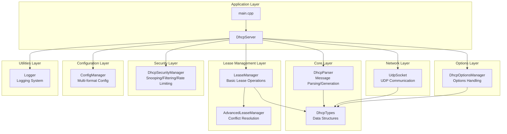
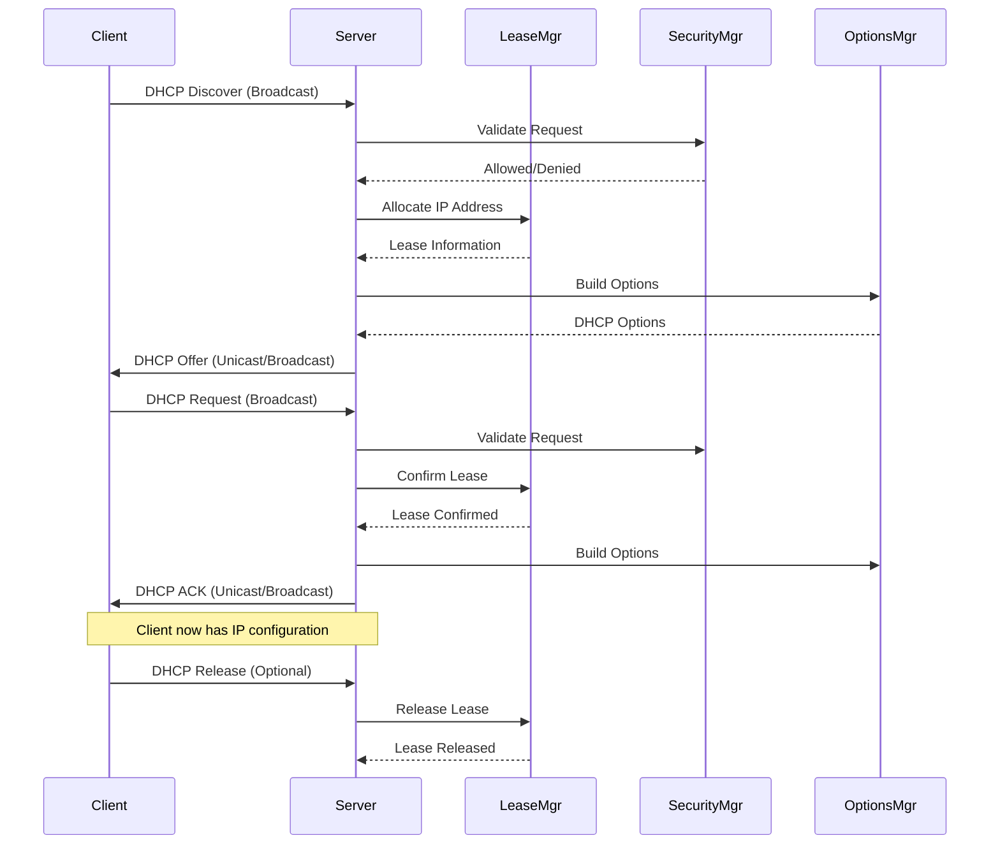
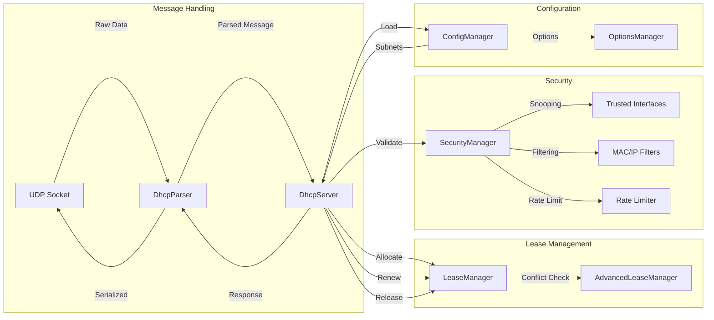
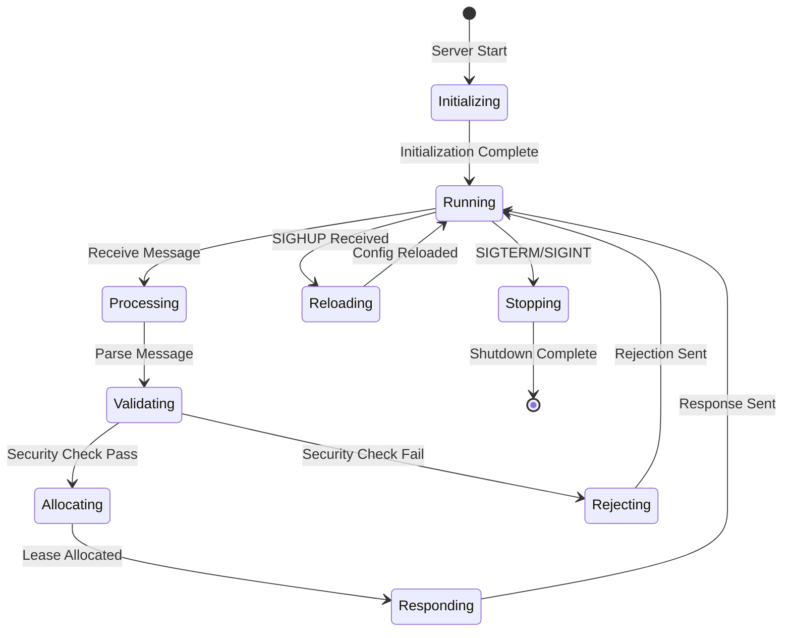
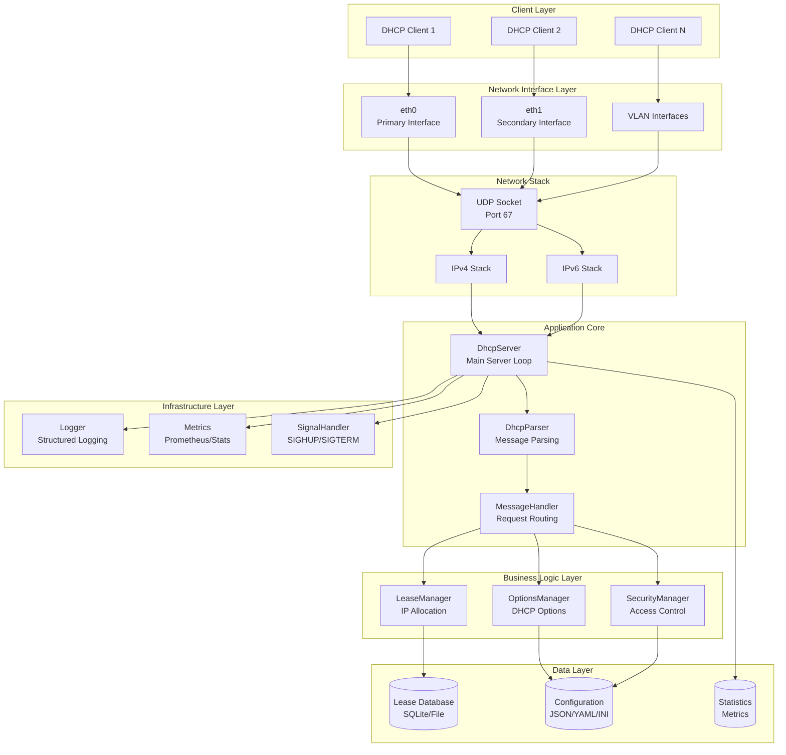
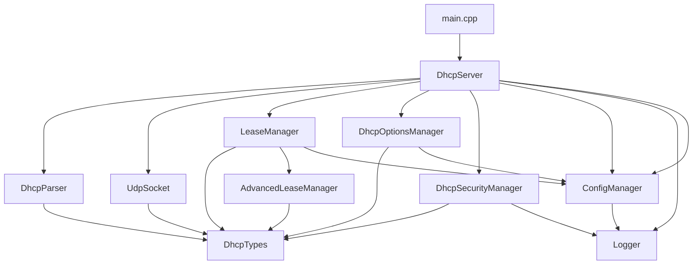
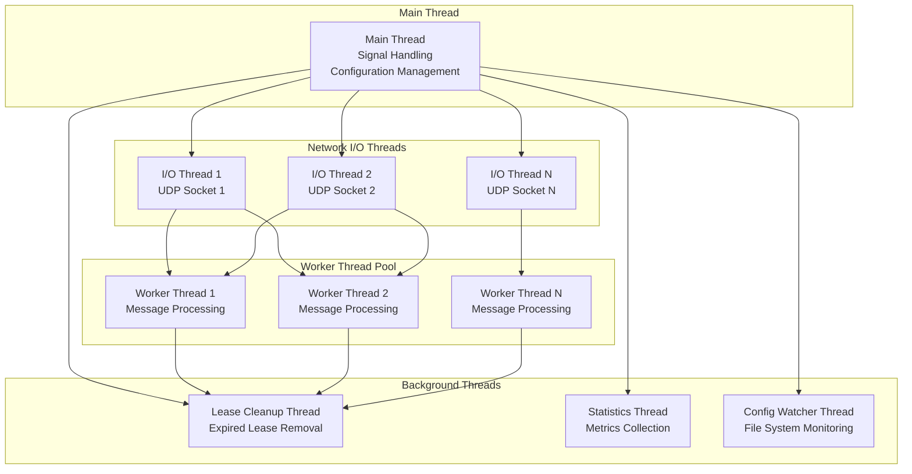

# Simple DHCP Daemon - Architecture Diagrams

## System Architecture

## DORA Process Flow

## Component Interaction

## State Machine

## Layered Architecture Detail

## Module Dependencies

## Threading Model

