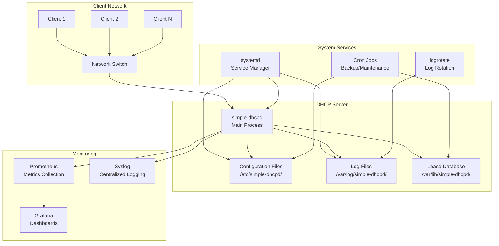
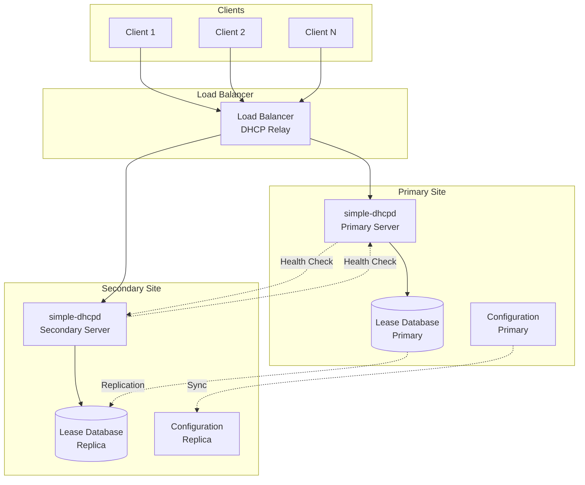
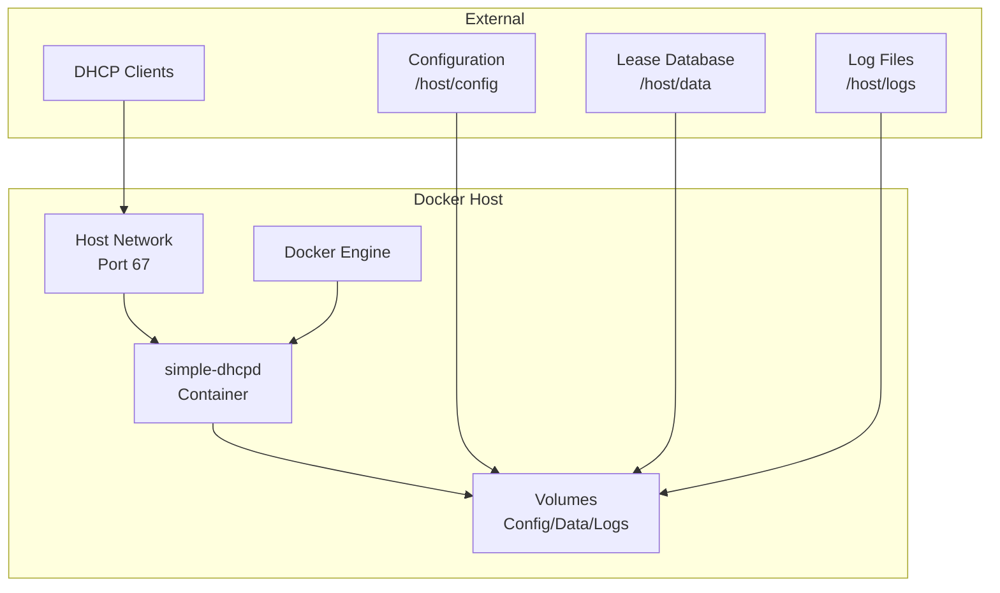
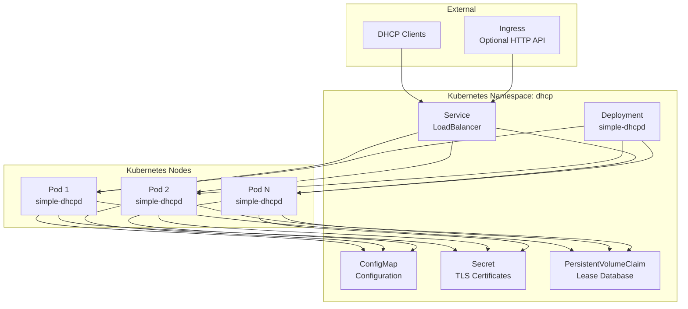
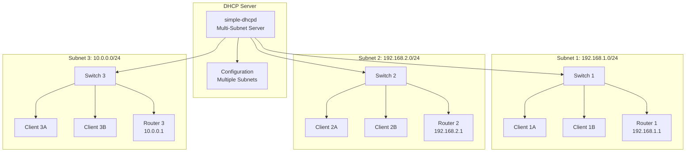
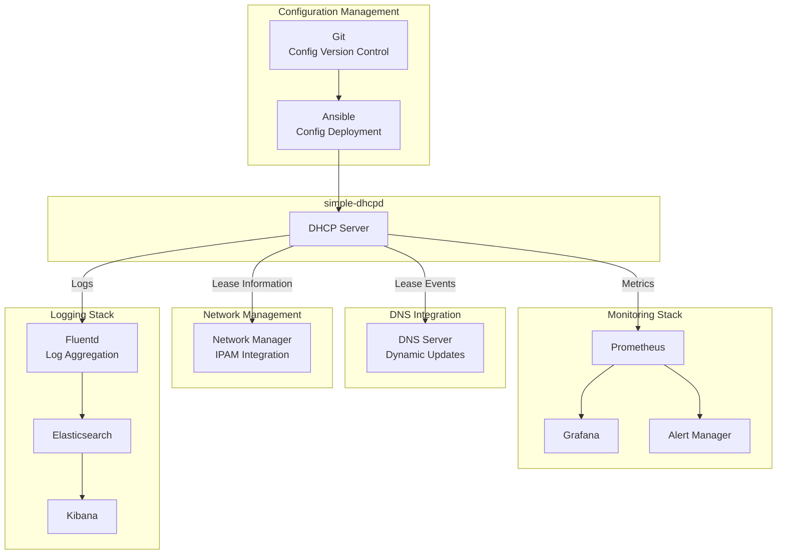

# Simple DHCP Daemon - Deployment Diagrams

## Deployment Architecture

## High Availability Deployment

## Container Deployment

## Kubernetes Deployment

## Multi-Subnet Deployment

## Service Integration

