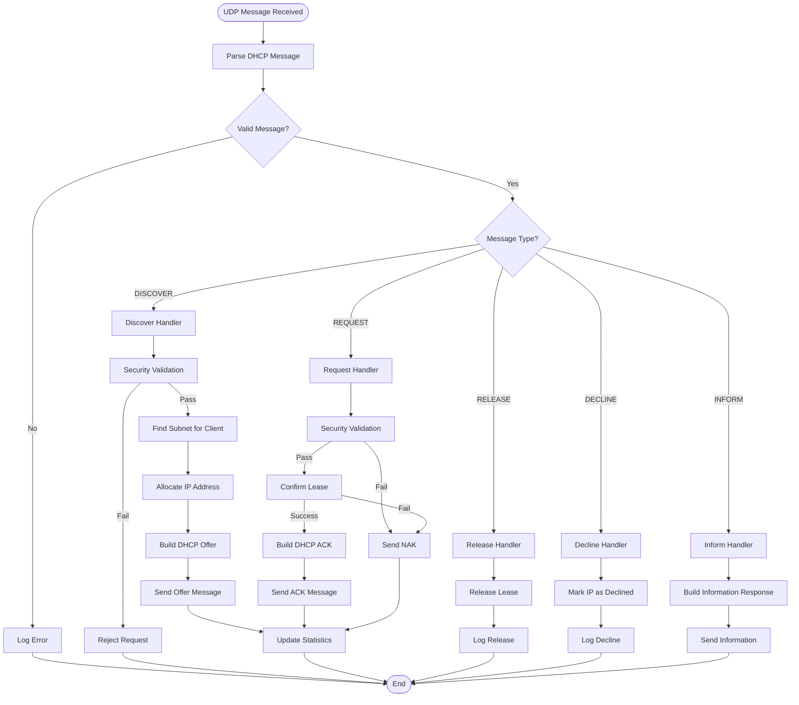
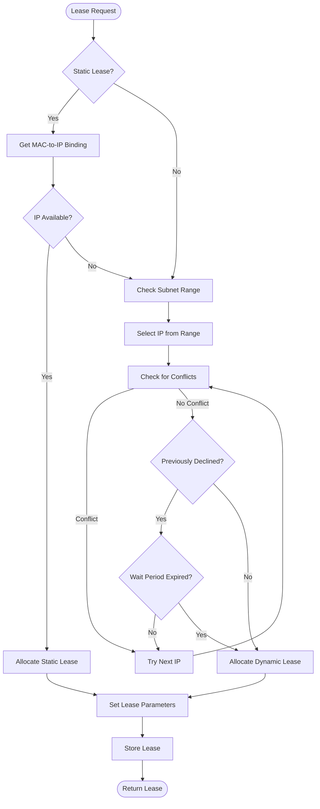
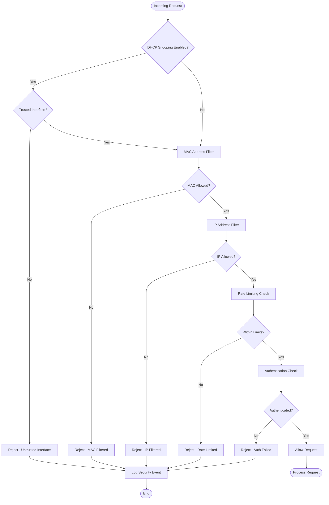

# Simple DHCP Daemon - Flow Diagrams

## DHCP Message Processing Flow

```mermaid
flowchart TD
    Start([UDP Message Received]) --> Parse[Parse DHCP Message]
    Parse --> Validate{Valid Message?}
    Validate -->|No| LogError[Log Error]
    Validate -->|Yes| CheckType{Message Type?}
    
    CheckType -->|DISCOVER| DiscoverFlow[Discover Handler]
    CheckType -->|REQUEST| RequestFlow[Request Handler]
    CheckType -->|RELEASE| ReleaseFlow[Release Handler]
    CheckType -->|DECLINE| DeclineFlow[Decline Handler]
    CheckType -->|INFORM| InformFlow[Inform Handler]
    
    DiscoverFlow --> SecurityCheck[Security Validation]
    SecurityCheck -->|Pass| FindSubnet[Find Subnet for Client]
    SecurityCheck -->|Fail| Reject[Reject Request]
    FindSubnet --> AllocateIP[Allocate IP Address]
    AllocateIP --> BuildOffer[Build DHCP Offer]
    BuildOffer --> SendOffer[Send Offer Message]
    
    RequestFlow --> SecurityCheck2[Security Validation]
    SecurityCheck2 -->|Pass| ConfirmLease[Confirm Lease]
    SecurityCheck2 -->|Fail| SendNAK[Send NAK]
    ConfirmLease -->|Success| BuildACK[Build DHCP ACK]
    ConfirmLease -->|Fail| SendNAK
    BuildACK --> SendACK[Send ACK Message]
    
    ReleaseFlow --> ReleaseLease[Release Lease]
    ReleaseLease --> LogRelease[Log Release]
    
    DeclineFlow --> MarkDeclined[Mark IP as Declined]
    MarkDeclined --> LogDecline[Log Decline]
    
    InformFlow --> BuildInfo[Build Information Response]
    BuildInfo --> SendInfo[Send Information]
    
    SendOffer --> UpdateStats[Update Statistics]
    SendACK --> UpdateStats
    SendNAK --> UpdateStats
    LogError --> End([End])
    Reject --> End
    UpdateStats --> End
    LogRelease --> End
    LogDecline --> End
    SendInfo --> End
```

## Lease Allocation Flow

```mermaid
flowchart TD
    Start([Lease Request]) --> CheckStatic{Static Lease?}
    CheckStatic -->|Yes| GetStatic[Get MAC-to-IP Binding]
    CheckStatic -->|No| CheckRange[Check Subnet Range]
    
    GetStatic --> ValidateStatic{IP Available?}
    ValidateStatic -->|Yes| AllocateStatic[Allocate Static Lease]
    ValidateStatic -->|No| CheckRange
    
    CheckRange --> SelectIP[Select IP from Range]
    SelectIP --> ConflictCheck[Check for Conflicts]
    ConflictCheck -->|Conflict| NextIP[Try Next IP]
    NextIP --> ConflictCheck
    ConflictCheck -->|No Conflict| CheckDeclined{Previously Declined?}
    
    CheckDeclined -->|Yes| WaitPeriod{Wait Period Expired?}
    WaitPeriod -->|No| NextIP
    WaitPeriod -->|Yes| AllocateDynamic[Allocate Dynamic Lease]
    CheckDeclined -->|No| AllocateDynamic
    
    AllocateStatic --> SetLease[Set Lease Parameters]
    AllocateDynamic --> SetLease
    SetLease --> StoreLease[Store Lease]
    StoreLease --> ReturnLease([Return Lease])
```

## Security Processing Flow

```mermaid
flowchart TD
    Start([Incoming Request]) --> SnoopingCheck{DHCP Snooping Enabled?}
    SnoopingCheck -->|Yes| CheckTrusted{Trusted Interface?}
    SnoopingCheck -->|No| MACCheck
    
    CheckTrusted -->|No| RejectSnoop[Reject - Untrusted Interface]
    CheckTrusted -->|Yes| MACCheck[MAC Address Filter]
    
    MACCheck --> MACAllowed{MAC Allowed?}
    MACAllowed -->|No| RejectMAC[Reject - MAC Filtered]
    MACAllowed -->|Yes| IPCheck[IP Address Filter]
    
    IPCheck --> IPAllowed{IP Allowed?}
    IPAllowed -->|No| RejectIP[Reject - IP Filtered]
    IPAllowed -->|Yes| RateLimit[Rate Limiting Check]
    
    RateLimit --> RateOK{Within Limits?}
    RateOK -->|No| RejectRate[Reject - Rate Limited]
    RateOK -->|Yes| AuthCheck[Authentication Check]
    
    AuthCheck --> AuthOK{Authenticated?}
    AuthOK -->|No| RejectAuth[Reject - Auth Failed]
    AuthOK -->|Yes| Allow[Allow Request]
    
    RejectSnoop --> LogSecurity[Log Security Event]
    RejectMAC --> LogSecurity
    RejectIP --> LogSecurity
    RejectRate --> LogSecurity
    RejectAuth --> LogSecurity
    Allow --> Process([Process Request])
    LogSecurity --> End([End])
```

