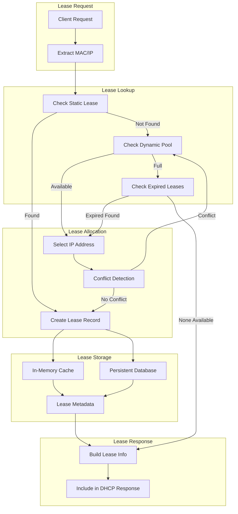
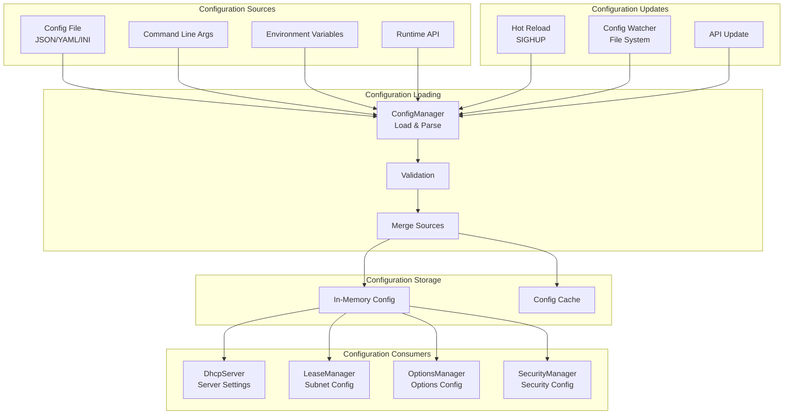
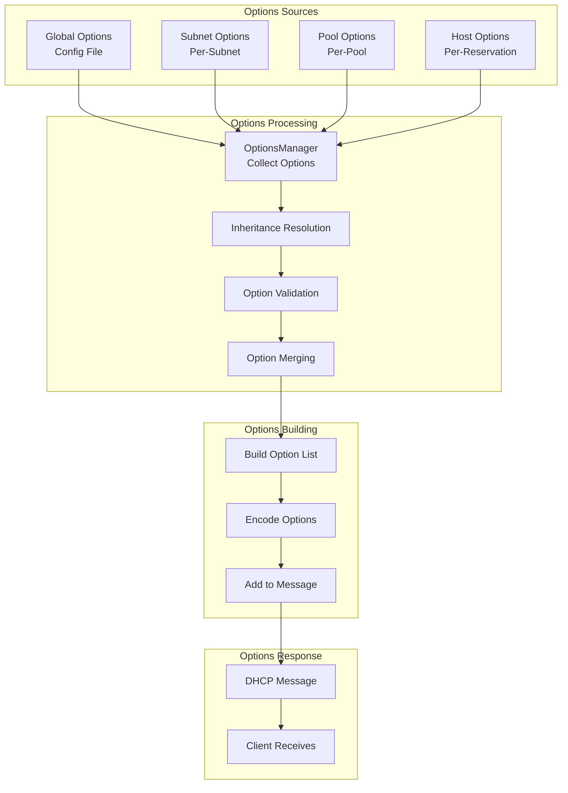
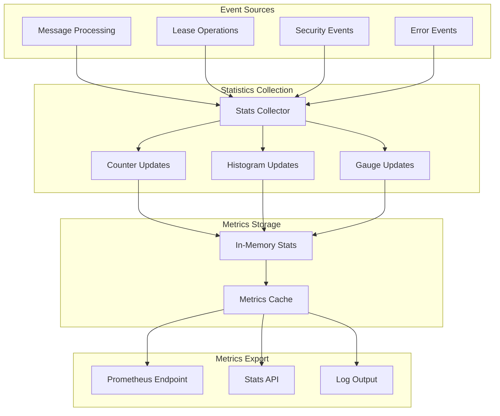
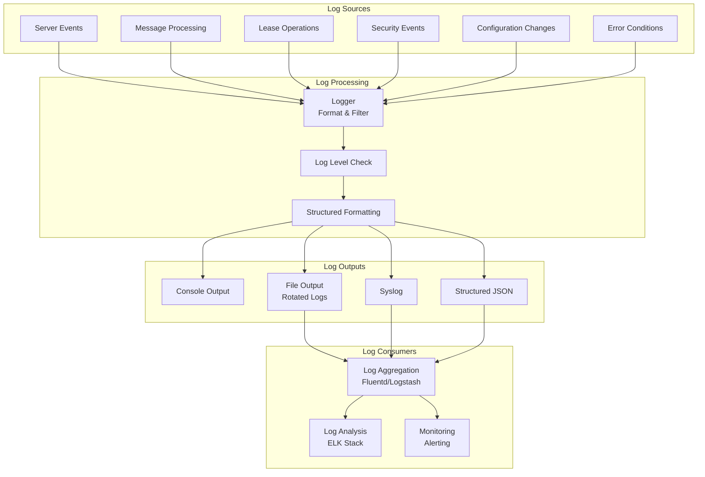

# Simple DHCP Daemon - Data Flow Diagrams

## DHCP Message Data Flow

```mermaid
flowchart LR
    subgraph "Client"
        C1[DHCP Client]
    end

    subgraph "Network"
        N1[UDP Packet<br/>Port 67]
    end

    subgraph "Server Input"
        S1[UDP Socket<br/>Receive]
        S2[Raw Bytes]
    end

    subgraph "Parsing"
        P1[DhcpParser<br/>Deserialize]
        P2[Parsed Message<br/>DhcpMessage]
    end

    subgraph "Processing"
        PR1[Message Handler]
        PR2[Security Check]
        PR3[Lease Management]
        PR4[Options Building]
    end

    subgraph "Response Generation"
        R1[Response Builder]
        R2[Serialized Message]
    end

    subgraph "Server Output"
        O1[UDP Socket<br/>Send]
        O2[UDP Packet<br/>Port 67]
    end

    C1 -->|DHCP Discover| N1
    N1 --> S1
    S1 --> S2
    S2 --> P1
    P1 --> P2
    P2 --> PR1
    PR1 --> PR2
    PR2 --> PR3
    PR3 --> PR4
    PR4 --> R1
    R1 --> R2
    R2 --> O1
    O1 --> O2
    O2 -->|DHCP Offer| C1
```

## Lease Data Flow

## Configuration Data Flow

## Options Data Flow

## Statistics and Metrics Data Flow

## Logging Data Flow

