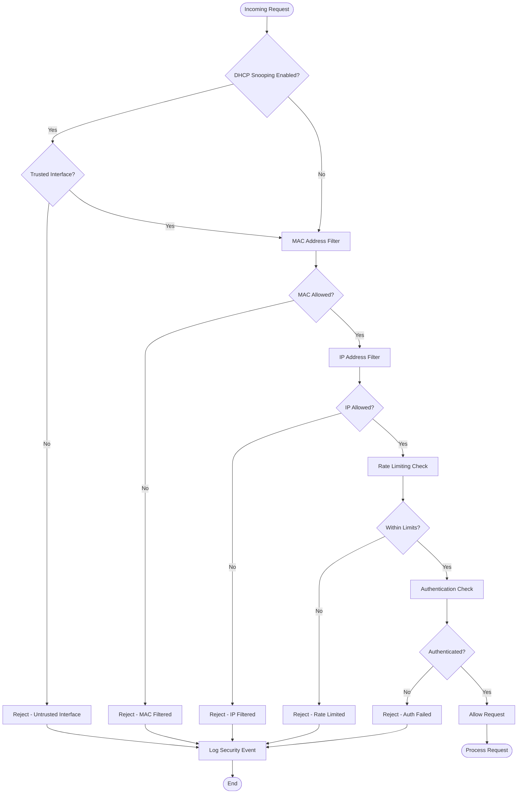

# Simple DHCP Daemon - Flow Diagrams

## DHCP Message Processing Flow

## Lease Allocation Flow

## Security Processing Flow

## Configuration Reload Flow

## Lease Renewal Flow

## Error Handling Flow

## Performance Optimization Flow

