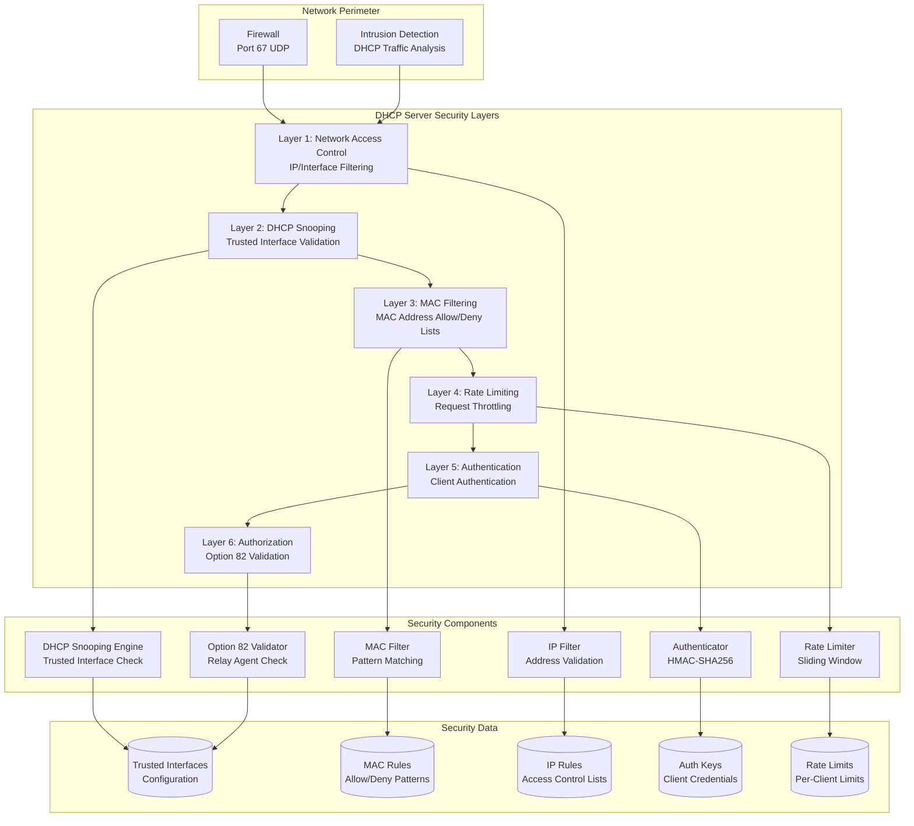
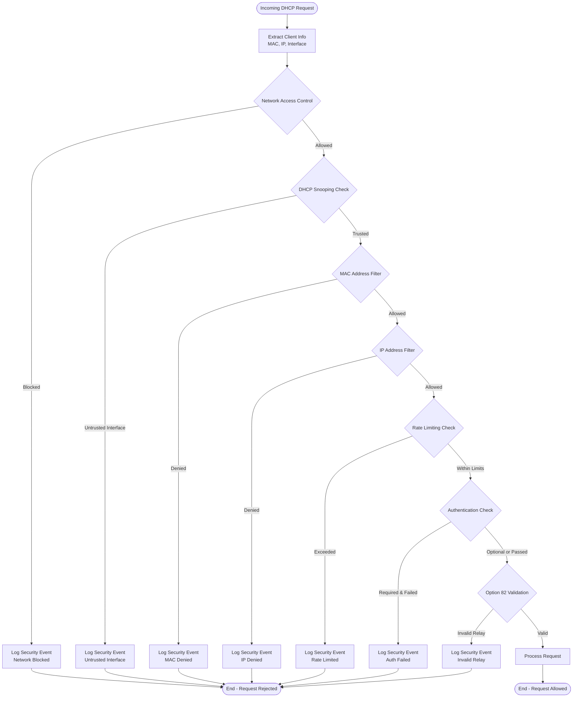
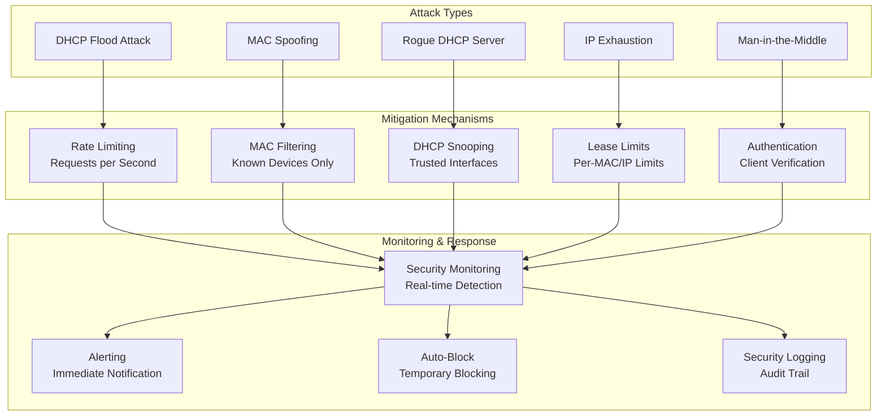
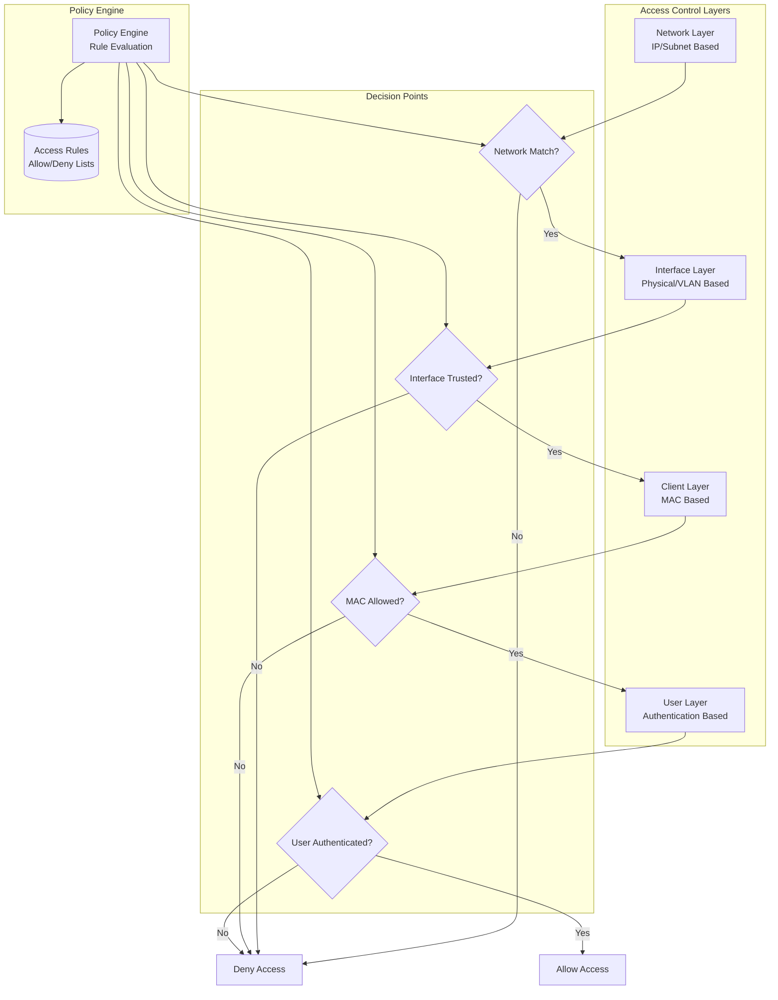
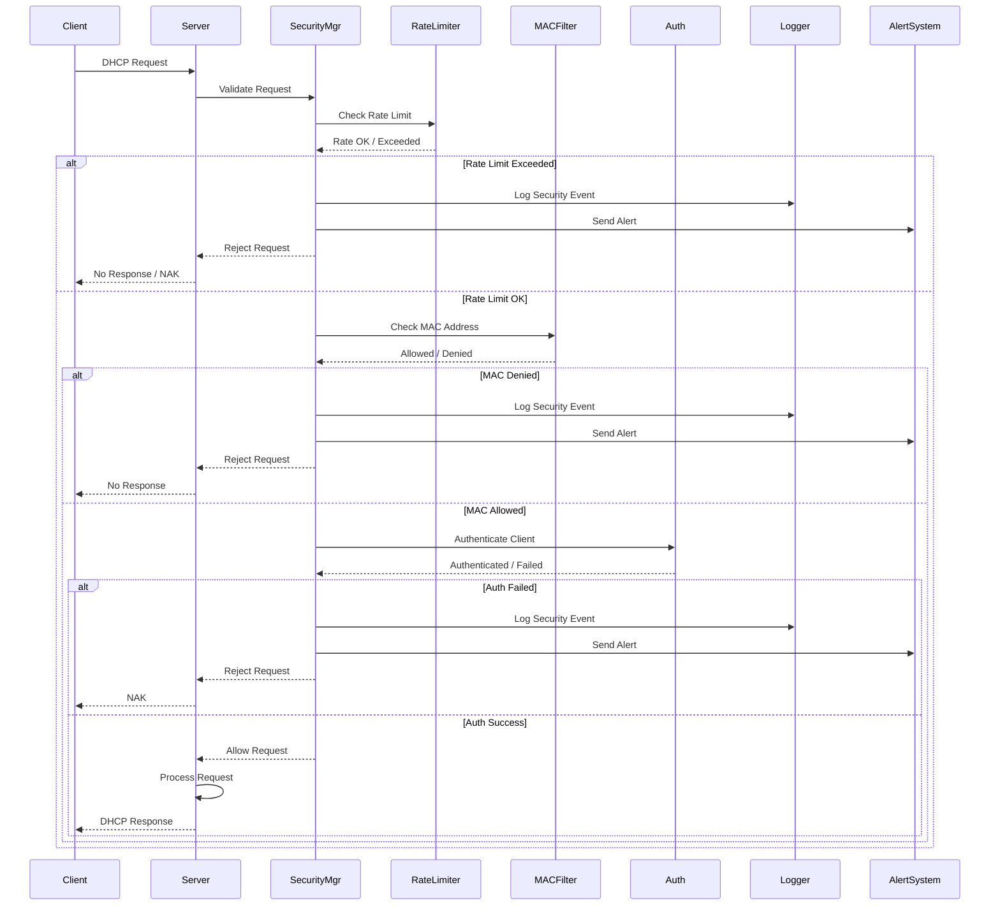

# Simple DHCP Daemon - Security Diagrams

## Security Architecture

```mermaid
graph TB
    subgraph "Network Perimeter"
        Firewall[Firewall<br/>Port 67 UDP]
        IDS[Intrusion Detection<br/>DHCP Traffic Analysis]
    end

    subgraph "DHCP Server Security Layers"
        Layer1[Layer 1: Network Access Control<br/>IP/Interface Filtering]
        Layer2[Layer 2: DHCP Snooping<br/>Trusted Interface Validation]
        Layer3[Layer 3: MAC Filtering<br/>MAC Address Allow/Deny Lists]
        Layer4[Layer 4: Rate Limiting<br/>Request Throttling]
        Layer5[Layer 5: Authentication<br/>Client Authentication]
        Layer6[Layer 6: Authorization<br/>Option 82 Validation]
    end

    subgraph "Security Components"
        Snooping[DHCP Snooping Engine<br/>Trusted Interface Check]
        MACFilter[MAC Filter<br/>Pattern Matching]
        IPFilter[IP Filter<br/>Address Validation]
        RateLimiter[Rate Limiter<br/>Sliding Window]
        Auth[Authenticator<br/>HMAC-SHA256]
        Option82[Option 82 Validator<br/>Relay Agent Check]
    end

    subgraph "Security Data"
        TrustedInterfaces[(Trusted Interfaces<br/>Configuration)]
        MACRules[(MAC Rules<br/>Allow/Deny Patterns)]
        IPRules[(IP Rules<br/>Access Control Lists)]
        AuthKeys[(Auth Keys<br/>Client Credentials)]
        RateLimits[(Rate Limits<br/>Per-Client Limits)]
    end

    Firewall --> Layer1
    IDS --> Layer1

    Layer1 --> IPFilter
    Layer1 --> Layer2
    Layer2 --> Snooping
    Layer2 --> Layer3
    Layer3 --> MACFilter
    Layer3 --> Layer4
    Layer4 --> RateLimiter
    Layer4 --> Layer5
    Layer5 --> Auth
    Layer5 --> Layer6
    Layer6 --> Option82

    Snooping --> TrustedInterfaces
    MACFilter --> MACRules
    IPFilter --> IPRules
    Auth --> AuthKeys
    RateLimiter --> RateLimits
    Option82 --> TrustedInterfaces
```

## Security Flow

```mermaid
flowchart TD
    Start([Incoming DHCP Request]) --> Extract[Extract Client Info<br/>MAC, IP, Interface]

    Extract --> Layer1{Network Access Control}
    Layer1 -->|Blocked| LogBlock1[Log Security Event<br/>Network Blocked]
    Layer1 -->|Allowed| Layer2

    Layer2{DHCP Snooping Check}
    Layer2 -->|Untrusted Interface| LogBlock2[Log Security Event<br/>Untrusted Interface]
    Layer2 -->|Trusted| Layer3

    Layer3{MAC Address Filter}
    Layer3 -->|Denied| LogBlock3[Log Security Event<br/>MAC Denied]
    Layer3 -->|Allowed| Layer4

    Layer4{IP Address Filter}
    Layer4 -->|Denied| LogBlock4[Log Security Event<br/>IP Denied]
    Layer4 -->|Allowed| Layer5

    Layer5{Rate Limiting Check}
    Layer5 -->|Exceeded| LogBlock5[Log Security Event<br/>Rate Limited]
    Layer5 -->|Within Limits| Layer6

    Layer6{Authentication Check}
    Layer6 -->|Required & Failed| LogBlock6[Log Security Event<br/>Auth Failed]
    Layer6 -->|Optional or Passed| Layer7

    Layer7{Option 82 Validation}
    Layer7 -->|Invalid Relay| LogBlock7[Log Security Event<br/>Invalid Relay]
    Layer7 -->|Valid| Process[Process Request]

    LogBlock1 --> End([End - Request Rejected])
    LogBlock2 --> End
    LogBlock3 --> End
    LogBlock4 --> End
    LogBlock5 --> End
    LogBlock6 --> End
    LogBlock7 --> End
    Process --> End2([End - Request Allowed])
```

## Attack Mitigation

```mermaid
graph TB
    subgraph "Attack Types"
        Flood[DHCP Flood Attack]
        Spoof[MAC Spoofing]
        Rogue[Rogue DHCP Server]
        Exhaust[IP Exhaustion]
        ManInMiddle[Man-in-the-Middle]
    end

    subgraph "Mitigation Mechanisms"
        RateLimit[Rate Limiting<br/>Requests per Second]
        MACFilter[MAC Filtering<br/>Known Devices Only]
        Snooping[DHCP Snooping<br/>Trusted Interfaces]
        LeaseLimit[Lease Limits<br/>Per-MAC/IP Limits]
        Auth[Authentication<br/>Client Verification]
    end

    subgraph "Monitoring & Response"
        Monitor[Security Monitoring<br/>Real-time Detection]
        Alert[Alerting<br/>Immediate Notification]
        AutoBlock[Auto-Block<br/>Temporary Blocking]
        Log[Security Logging<br/>Audit Trail]
    end

    Flood --> RateLimit
    Spoof --> MACFilter
    Rogue --> Snooping
    Exhaust --> LeaseLimit
    ManInMiddle --> Auth

    RateLimit --> Monitor
    MACFilter --> Monitor
    Snooping --> Monitor
    LeaseLimit --> Monitor
    Auth --> Monitor

    Monitor --> Alert
    Monitor --> AutoBlock
    Monitor --> Log
```

## Access Control Model

```mermaid
graph TB
    subgraph "Access Control Layers"
        Network[Network Layer<br/>IP/Subnet Based]
        Interface[Interface Layer<br/>Physical/VLAN Based]
        Client[Client Layer<br/>MAC Based]
        User[User Layer<br/>Authentication Based]
    end

    subgraph "Policy Engine"
        Policy[Policy Engine<br/>Rule Evaluation]
        Rules[(Access Rules<br/>Allow/Deny Lists)]
    end

    subgraph "Decision Points"
        Check1{Network Match?}
        Check2{Interface Trusted?}
        Check3{MAC Allowed?}
        Check4{User Authenticated?}
    end

    Network --> Check1
    Check1 -->|No| Deny[Deny Access]
    Check1 -->|Yes| Interface

    Interface --> Check2
    Check2 -->|No| Deny
    Check2 -->|Yes| Client

    Client --> Check3
    Check3 -->|No| Deny
    Check3 -->|Yes| User

    User --> Check4
    Check4 -->|No| Deny
    Check4 -->|Yes| Allow[Allow Access]

    Policy --> Rules
    Policy --> Check1
    Policy --> Check2
    Policy --> Check3
    Policy --> Check4
```

## Security Event Flow

```mermaid
sequenceDiagram
    participant Client
    participant Server
    participant SecurityMgr
    participant RateLimiter
    participant MACFilter
    participant Auth
    participant Logger
    participant AlertSystem

    Client->>Server: DHCP Request
    Server->>SecurityMgr: Validate Request

    SecurityMgr->>RateLimiter: Check Rate Limit
    RateLimiter-->>SecurityMgr: Rate OK / Exceeded

    alt Rate Limit Exceeded
        SecurityMgr->>Logger: Log Security Event
        SecurityMgr->>AlertSystem: Send Alert
        SecurityMgr-->>Server: Reject Request
        Server-->>Client: No Response / NAK
    else Rate Limit OK
        SecurityMgr->>MACFilter: Check MAC Address
        MACFilter-->>SecurityMgr: Allowed / Denied

        alt MAC Denied
            SecurityMgr->>Logger: Log Security Event
            SecurityMgr->>AlertSystem: Send Alert
            SecurityMgr-->>Server: Reject Request
            Server-->>Client: No Response
        else MAC Allowed
            SecurityMgr->>Auth: Authenticate Client
            Auth-->>SecurityMgr: Authenticated / Failed

            alt Auth Failed
                SecurityMgr->>Logger: Log Security Event
                SecurityMgr->>AlertSystem: Send Alert
                SecurityMgr-->>Server: Reject Request
                Server-->>Client: NAK
            else Auth Success
                SecurityMgr-->>Server: Allow Request
                Server->>Server: Process Request
                Server-->>Client: DHCP Response
            end
        end
    end
```
